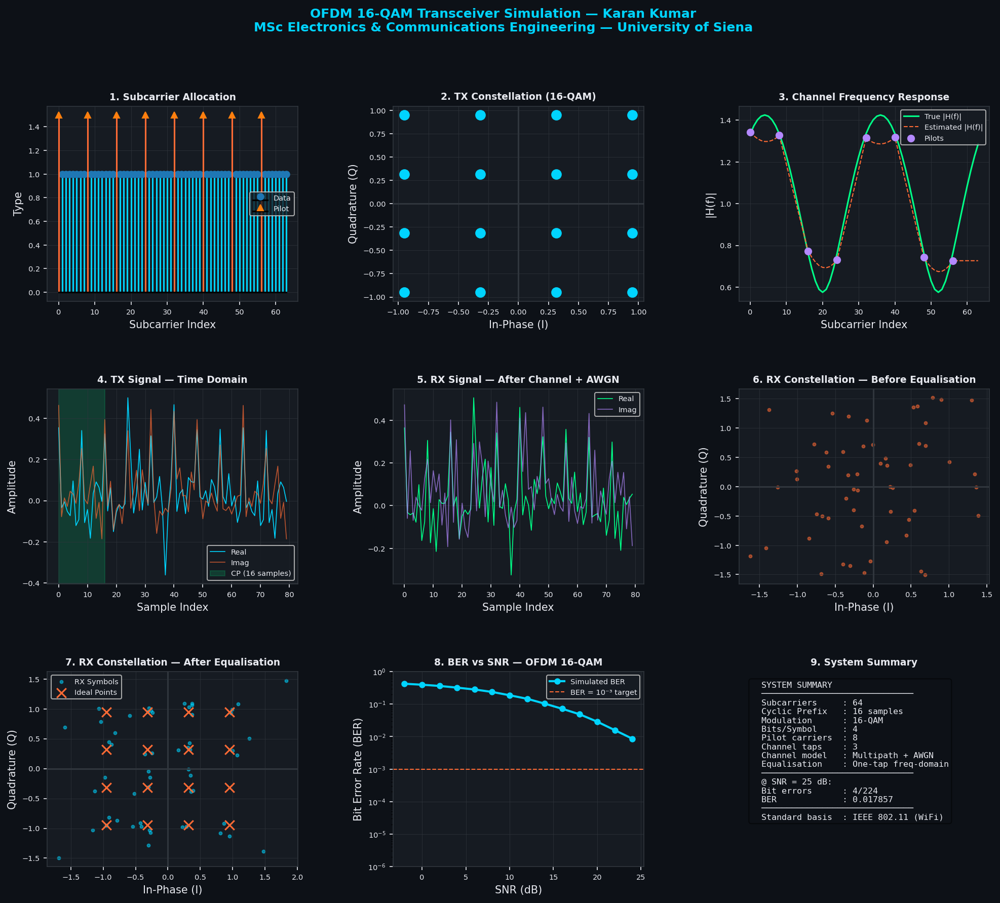

# OFDM Physical Layer Transceiver with 16-QAM Modulation
### Design and Simulation of an IEEE 802.11-Based OFDM Transceiver  
### with Pilot-Aided Channel Equalisation



## Overview
A complete OFDM (Orthogonal Frequency Division Multiplexing) physical 
layer transceiver implemented in Python, simulating the core signal 
processing chain of modern wireless communication standards such as 
IEEE 802.11 (Wi-Fi) and LTE.

## System Parameters
| Parameter | Value |
|---|---|
| Total Subcarriers | 64 |
| Cyclic Prefix Length | 16 samples (25%) |
| Modulation | 16-QAM (Gray coded) |
| Bits per Symbol | 4 |
| Pilot Subcarriers | 8 (evenly spaced) |
| Channel Model | 3-tap Multipath + AWGN |
| Equalisation | One-tap Frequency-Domain |
| Standard Basis | IEEE 802.11 (Wi-Fi) |

## Features
- **16-QAM Gray-coded modulator and demodulator**
- **OFDM symbol builder** with IFFT multicarrier transmission
- **Cyclic prefix** insertion and removal (ISI elimination)
- **Pilot subcarrier** insertion for channel estimation
- **3-tap multipath fading channel** via convolution
- **AWGN noise** simulation at configurable SNR
- **Pilot-aided channel estimation** with linear interpolation
- **One-tap frequency-domain equalisation**
- **BER vs SNR Monte Carlo simulation** over -2 to +24 dB range
- **9-panel visualisation**: constellations, spectra, BER curve, 
  channel response, time-domain signals, system summary

## Results
| SNR (dB) | BER (Simulated) |
|---|---|
| 0 dB | ~0.39 |
| 10 dB | ~0.19 |
| 20 dB | ~0.03 |
| 24 dB | ~0.009 |

## How to Run
```bash
# Clone repository
git clone https://github.com/Karanvaswani/OFDM-16QAM-Transceiver-Simulation
cd OFDM-16QAM-Transceiver-Simulation

# Install dependencies
pip install -r requirements.txt

# Run simulation
python ofdm_16qam_transceiver.py
```

## Concepts Demonstrated
- Orthogonal Frequency Division Multiplexing (OFDM)
- 16-QAM Gray-coded modulation & hard-decision demodulation
- Cyclic prefix and inter-symbol interference (ISI) elimination
- Multipath fading channel modelling
- Pilot-aided least-squares channel estimation
- Frequency-domain one-tap equalisation
- Monte Carlo BER simulation
- FFT/IFFT multicarrier signal processing

## Tools & Technologies
Python | NumPy | SciPy | Matplotlib | Digital Communications | 
Signal Processing | IEEE 802.11

## Author
**Karan Kumar** — Electronics Engineer  
B.E. Electronic Engineering, Mehran University of Engineering & Technology  
IEEE Published Researcher (ICETECC 2025)  
GitHub: [Karanvaswani](https://github.com/Karanvaswani)  
LinkedIn: [karan-kumar-electronics-engineer](https://www.linkedin.com/in/karan-kumar-electronics-engineer/)

## License
MIT License — free to use for educational purposes.
